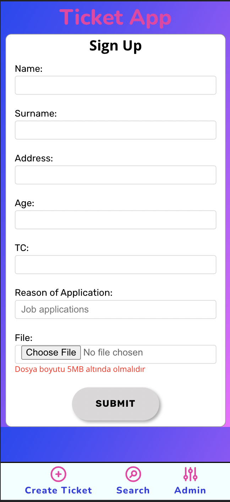
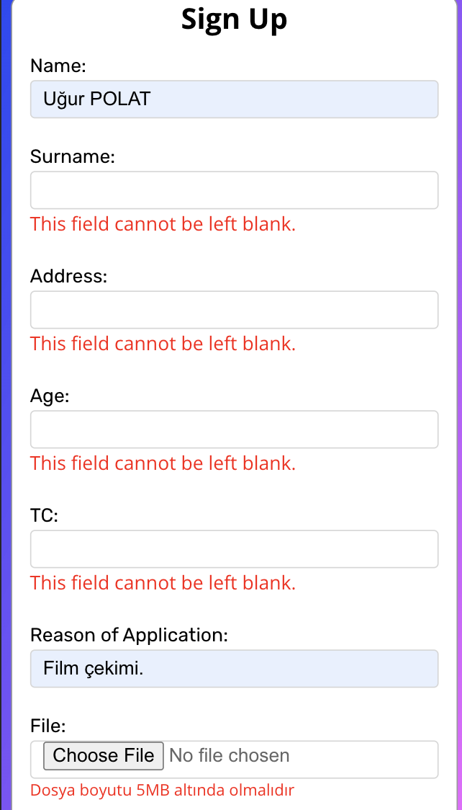
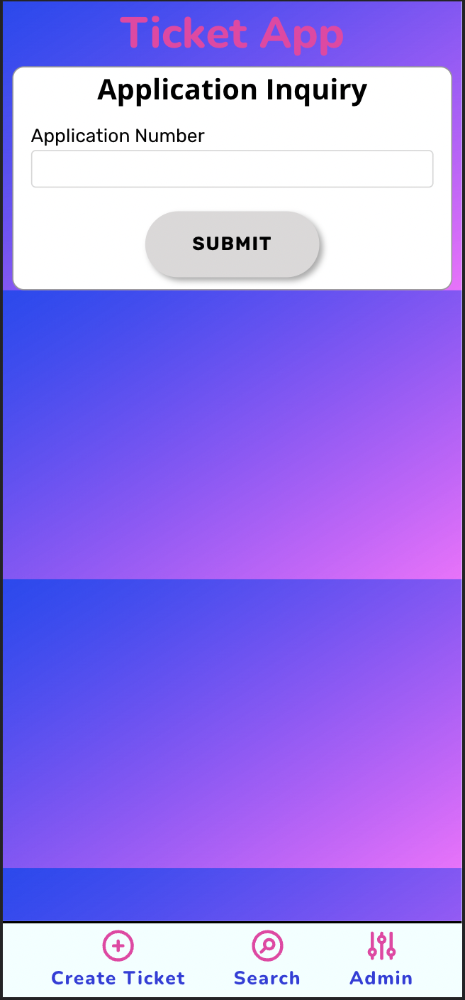
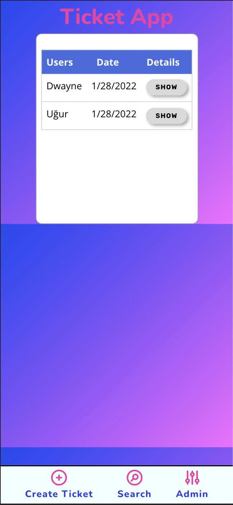

## Bitirme projesi

İlgili projenin linki: https://final-project-ugurpolat.vercel.app/
Admin:kodluyoruz
Password:bootcamp109

# Ticket-App

Ticket App uygulaması Pazarama ve Patika işbirliğiyle düzenlenen bootcampin bitirme projesidir.

## Giriş - Uygulamanın Amacı

Uygulamamız herkese açık bir başvuru formunun son kullanıcı tarafından doldurulması ile başlıyor.
Formu dolduran kullanıcıya başvurusunu takip edebilecegi bir kod veriliyor. Kullanıcı başvuru durumu sayfasından bu kod ile başvurusunun çözülüp çözülemedigini kontrol edebiliyor.

Kullanıcı adı ve şifre ile girilebilen bir ekrandan da yetkili kullanıcılar gelen başvuruları görüntüleyebiliyor cevaplanmamış başvurulara cevap yazıp durumunu çözüldü / iptal edildi / bekliyor vb gibi güncelleyebiliyor. Gerekirse eski kayıtlara ulaşabiliyor.

## İçerik

- [Genel Bilgi](#genel-bilgi)
- [İçerik](#içerik)
- [Nasıl Kullanılır](#nasıl-kullanılır)

## Genel Bilgi

Ticket-App ile işlemlerinizi daha hızlı yapabilirsiniz. Tek tuşla anlık olarak başvuru numaranızı aratın ve başvurunuz hakkındaki en güncel bilgiye hemen erişin...

## İçerik

Ticket App projesi bir react projesidir. Backend olarak MockApi kullanılmıştır. CSS yapısını, BEM metodolojisine olabildiğince yaklaşarak yazmaya çalıştım. Kullanıcı form oluşturduktan sonra hatalı yerleri Formik kütüphanesinde bulunan useFormik hookunu kullanarak gerekli validasyon işlemlerini yaptım.

Kullanıcının yüklediği resimleri, MockApi'nin üst limiti olarak belirlenen 5MB aşağısında sabitledim. Gelen resimleri base64 ile veritabanına aktardım. Resim verisini çekerkende belirlenen img src attibute'ne aktarımda bulundum.

## Nasıl Kullanılır

Kullanıcı tarafından kaydedilen verileri admin, ilgili panelden girerek toplamda kayıt olan kullanıcıları görebilir. Çeşitli değişikliklerde bulunabilir. Kullanıcıyı silebilir ve güncelleyebilir.

Oyunun bölümlerinde oyunu oynayan öğrencilerden istenen görevler farklıdır. Oyun sırasında veya oyundan önce oyunun nasıl oynandığı hakkında bilgilendirme öğrenciye gösterilir.

